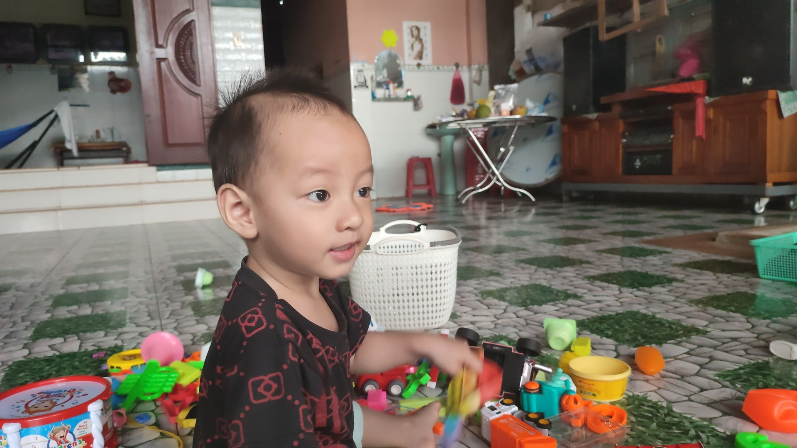

  

<h1 class="title is-3 is-size-4-mobile has-text-centered">
Thien Nguyen
</h1>
<h5 class="title is-3 is-size-8-mobile has-text-centered has-text-grey">Minimalism is not a lack of something. It’s simply the perfect amount of something.</h5>



<!-- tab id:about-me-vi "icon:fas fa-cubes" "title:Tiếng Việt" active -->

Xin chào 👋 👋🏻 👋🏽(vẫy tay x3,14),

Chào mừng bạn đến **"khu vườn trên mây 🌥️"** của mình. Mình gọi thế vì đây là nơi để mình nghỉ ngơi, suy ngẫm và sẻ chia những câu chuyện về cuộc sống và công việc.

😆 *Vì code bao năm vẫn chưa thoát nghèo nên mình chỉ đủ tiền mua "sổ đỏ" trên internet và xây nên khu vườn này
(so-called, **The garden in the clouds**)*.

## Về mình 👉 👈

Mình tên đầy đủ là Nguyễn Ngọc Phước Thiện.

Năm 2023, mình tròn 30 tuổi.

Hiện tại mình là kỹ sư phần mềm tại một [công ty phát triển Game của Singapore](/cv/#Work-Experience).

Mình luôn tìm thấy sự mâu thuẫn, ngay cả trong chính bản thân mình. Miệng thì luôn nói rằng thích sự tối giản nhưng lại muốn làm mọi thứ trở nên phức tạp. Thuận tay phải nhưng lại dùng đũa tay trái.

Mình đã lập gia đình và đã có một con trai thường gọi là Cà rốt 🥕🥕 (tên cúng cơm do bà nội đặt)

    

## Về blog này 🍻

Mình bắt đầu viết blog từ đầu những năm 20 của thế kỷ 21. Trải qua gần 1/3 thập kỷ  hình thành và phát triển, tuy số lượng bài viết không đồ sộ nhưng chúng luôn mang giá trị hoài niệm vô cùng to lớn đối với bản thân mình.

Mình viết những gì mình muốn nên không có những đề tài cụ thể, chỉ đơn giản là đặt bút xuống và viết.

Tương lai, mình dự định sẽ xây dựng thêm chuyên mục Podcast 🎤, thay vì dùng chữ viết thì mình sẽ lời nói để chia sẻ.

## Lời kết

Dù bạn là ai, đến từ đâu, làm công việc gì, cảm ơn bạn đã ghé thăm **Khu vườn trên mây** của mình.

Mình chắc chắn không phải là người truyền cảm hứng (to tát quá), nhưng chắc chắn sẽ là người luôn sẵn sàng lắng nghe nếu bạn muốn chia sẻ câu chuyện của chính mình. Biết đâu chúng ta lại có điểm chung nào đó?

Hy vọng bạn tìm thấy điều gì đó thú vị khi đọc bài trên blog của mình.

 

 ☀️🌈🚀
Chúc bạn một ngày tốt lành!
 
<strong>Thiện Nguyễn</strong>
tại <em>Khu vườn trên mây</em>

<!-- endtab -->

<!-- tab id:about-me-en "icon:fas fa-file-code" "title:English" -->

## About me

Hi 👋, I am Thien Nguyen, aka William Nguyen.
I am a backend developer as well as a father of one child.
I work for Gamify Studios, a game development company located in Ho Chi Minh City, Vietnam.

<!-- endtab -->


