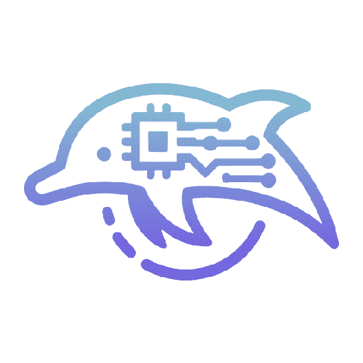
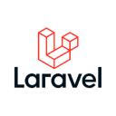

Hello, I’m Thien, a  based in Ho Chi Minh City, Vietnam.
With a passion for programming and web/app development, I aspire to become a full-stack developer. 
I thrive in collaborative environments and believe in continuous learning. I'm eager to join innovative teams where I can learn from others, contribute my skills, and enhance my abilities.

### <i class="fas fa-info-circle"></i> Information

    

        
Full name

        
Thien Nguyen

    

    

        
Email

        
hi@thiennguyen.dev

    

    

        
Phone

        
(+84) 395 443 490

    

    

        
Location

        
Ho Chi Minh City, Vietnam

    

    

        
Languages

        

            <!--  -->
            

                

                    

                    
                        <figure class="image is-16x16 mr-0 ml-0">
                            
                        </figure>
                    
                    Vietnamese
                    

                

                

                    

                    
                        <figure class="image is-16x16 mr-0 ml-0">
                            
                        </figure>
                    
                    English
                    

                

            

            <!--  -->
        

    

### <i class="fas fa-briefcase"></i> Work Experience

    <article class="media" style="color: unset;">
        <figure class="media-left" style="margin-left: 0; margin-bottom: 0; margin-right: 1rem">
            
            
        </figure>
        

            <h4 class="is-size-6 is-uppercase" id="work-experience-gamify-studios"><strong>Apr 2023 - Now <a href="https://pilotpulse.ai/">PilotPulse.ai</a></strong></h4>
            AI Software Engineer
            
Product: AI Agents for business

            

            <i class="fa-solid fa-bookmark is-size-7 has-text-warning"></i> Developed and maintained RESTful APIs and dashboard to manage users, knowledge base & prompt.
            

            <!-- 

            <i class="fa-solid fa-bookmark is-size-7 has-text-warning"></i> (& more to be updated)
            
 -->
            

                Keywords
                Go
                Python
                PostgreSQL
                MongoDB
                AI
                ReactJS
            

        

    </article>
    <article class="media" style="color: unset;">
        <figure class="media-left" style="margin-left: 0; margin-bottom: 0; margin-right: 1rem">
            
            
        </figure>
        

            <h4 class="is-size-6 is-uppercase" id="work-experience-gamify-studios"><strong>Sep 2022 - Feb 2023 <a href="#">Gamify Studios Company Limited</a></strong></h4>
            Software Engineer
            
Product: Back Office Gaming Management System

            

            <i class="fa-solid fa-bookmark is-size-7 has-text-warning"></i> Developed and maintained RESTful APIs for a comprehensive management system handling users, games, players, events, missions, and marketing campaigns.
            

            

            <i class="fa-solid fa-bookmark is-size-7 has-text-warning"></i> Utilized microservice architecture to build and integrate various sub-systems, including a report module, cron service, and inbox message.
            

            

            <i class="fa-solid fa-bookmark is-size-7 has-text-warning"></i> Collaborated with front-end developers, database administrators, and project managers to ensure exceptional user experiences and meet project requirements.
            

            

            <i class="fa-solid fa-bookmark is-size-7 has-text-warning"></i> Contributed to documentation and knowledge sharing within the technical team.
            

            

                Keywords
                Go
                NestJS
                TypeORM
                RabbitMQ
                Redis
                ElasticSearch
                MySQL
                TypeScript
            

        

    </article>
    <article class="media" style="color: unset;">
        <figure class="media-left" style="margin-left: 0; margin-bottom: 0; margin-right: 1rem">
            
            
        </figure>
        

            <h4 class="is-size-6 is-uppercase" id="work-experience-cmc-global"><strong>Sep 2021 - Sep 2022 <a href="https://cmcglobal.com.vn/" target="_blank">CMC Global Company Limited</a></strong></h4>
            Software Engineer
            
Projects: THK CMMS, THK Order System & HACCP Report

            

            <i class="fa-solid fa-bookmark is-size-7 has-text-warning"></i> Estimated project timelines and resources required for completion.
            

            

            <i class="fa-solid fa-bookmark is-size-7 has-text-warning"></i> Provided guidance, conducted code reviews, and ensured code quality.
            

            

            <i class="fa-solid fa-bookmark is-size-7 has-text-warning"></i> Developed robust RESTful APIs using Node.js and NestJS framework, Microsoft SQL Server, Azure Blob Storage, and Google Firebase.
            

            

            <i class="fa-solid fa-bookmark is-size-7 has-text-warning"></i> Utilized Docker to containerize web applications and deploy them to Azure app service, ensuring seamless deployment and scalability.
            

            

                Keywords
                NestJS
                ExpressJs
                Prisma ORM
                Docker
                Azure
                Firebase
                PostgreSQL
            

        

    </article>
    <article class="media" style="color: unset;">
        <figure class="media-left" style="margin-left: 0; margin-bottom: 0; margin-right: 1rem">
            
            
        </figure>
        

            <h4 class="is-size-6 is-uppercase" id="work-experience-hpt-vietnam-corp"><strong> Apr 2020 - Aug 2021<a href="https://www.hpt.vn/" target="_blank"> HPT Vietnam Corporation</a></strong></h4>
            Software Engineer
            
Projects: Cash Vault Management (Techcombank)

            

            <i class="fa-solid fa-bookmark is-size-7 has-text-warning"></i> Developed an automated cash vault management system on top of the IBM BPM platform, significantly augmenting operational efficiency.
            

            

            <i class="fa-solid fa-bookmark is-size-7 has-text-warning"></i> Designed and implemented Oracle SQL stored procedures to optimize data retrieval and processing for application functionality.
            

            

                Keywords
                IBM BPM
                IBM ECM
                Javascript
                ReactJS
                Oracle SQL
                WebSphere
            

        

    </article>

### <i class="fa fa-star"></i> Personal Projects

    <article class="media" style="color: unset;">
        <figure class="media-left" style="margin-left: 0; margin-bottom: 0; margin-right: 1rem">
            
            
        </figure>
        

            <h4 class="is-size-6" id="project-ripplify"><strong><a href="https://ripplify.thiennguyen.dev/" target="_blank">Ripplify</a></strong> JUN 2021</h4>
            
A free, handy and delightful tool initially designed for presenters, trainers and teachers who want to highlight their mouse pointer.

        

    </article>
    <article class="media" style="color: unset;">
        <figure class="media-left" style="margin-left: 0; margin-bottom: 0; margin-right: 1rem">
            
            
        </figure>
        

            <h4 class="is-size-6" id="project-fscup"><strong><a href="https://fsc-utilities-plugin.netlify.app/" target="_blank">FSC Utilities Plugin</a></strong> MAR 2019 (EOL)</h4>
            
A data input assistance software that enhances work productivity while ensuring precision and reliability.

        

    </article>

### <i class="fas fa-graduation-cap"></i> Education

    <article class="media" style="color: unset;">
        <figure class="media-left" style="margin-left: 0; margin-bottom: 0; margin-right: 1rem">
            <!--  -->
            <!--  -->
            
        </figure>
        

            <h4 class="is-size-6 is-uppercase" id="education-hcmus"><strong> Dec 2017 - Oct 2020 <a href="https://www.hcmus.edu.vn" target="_blank">VNUHCM - University of Science</a></strong></h4>
            
B.S in Information Technology

            
Cloud Computing for Business, Data Structure and Algorithms, Object-oriented Programming, Databases and Database Management Systems, HTML, CSS, Node.js, Javascript, MySQL.

        

    </article>
    <article class="media" style="color: unset;">
        <figure class="media-left" style="margin-left: 0; margin-bottom: 0; margin-right: 1rem">
            <!--  -->
            <!--  -->
            
        </figure>
        

            <h4 class="is-size-6 is-uppercase" id="education-hcmute"><strong> Sep 2011 - Dec 2015 <a href="https://hcmute.edu.vn" target="_blank">HCMC University of Technology and Education</a></strong></h4>
            
B.A in English Language Teaching

            
English for Business, English for Computing, English for Electrical and Electronic Engineering, Learners' Psychology, and Teaching Methodology.

        

    </article>

### <i class="fas fa-certificate"></i> Certifications

    <article class="media" style="color: unset;">
        <figure class="media-left" style="margin-left: 0; margin-bottom: 0; margin-right: 1rem">
            <!--  -->
            <!--  -->
            
        </figure>
        

            <h4 class="is-size-6" id="certification-git-github">
                <strong>
                    Apr 2024
                    <a class="gallery-item" href="/assets/img/codecademy-git-github-cert.png">
                        
                        Certificate of Completion for the Learn Git & GitHub Course
                    </a>
                </strong>
            </h4>
            
Codecademy

        

    </article>
    <article class="media" style="color: unset;">
        <figure class="media-left" style="margin-left: 0; margin-bottom: 0; margin-right: 1rem">
            
            
        </figure>
        

            <h4 class="is-size-6" id="certification-reactjs"><strong>Jan 2021 <a class="gallery-item" href="/assets/img/zendvn-cert.png">Certificate of Achievement in Completion of ReactJS Programming</a></strong></h4>
            
Zend Vietnam

        

    </article>
    <article class="media" style="color: unset;">
        <figure class="media-left" style="margin-left: 0; margin-bottom: 0; margin-right: 1rem">
            
            
        </figure>
        

            <h4 class="is-size-6" id="certification-php"><strong>Sep 2020 Certificate of Completion of PHP Programming Training Course</strong></h4>
            
APTECH Saigon

        

    </article>

